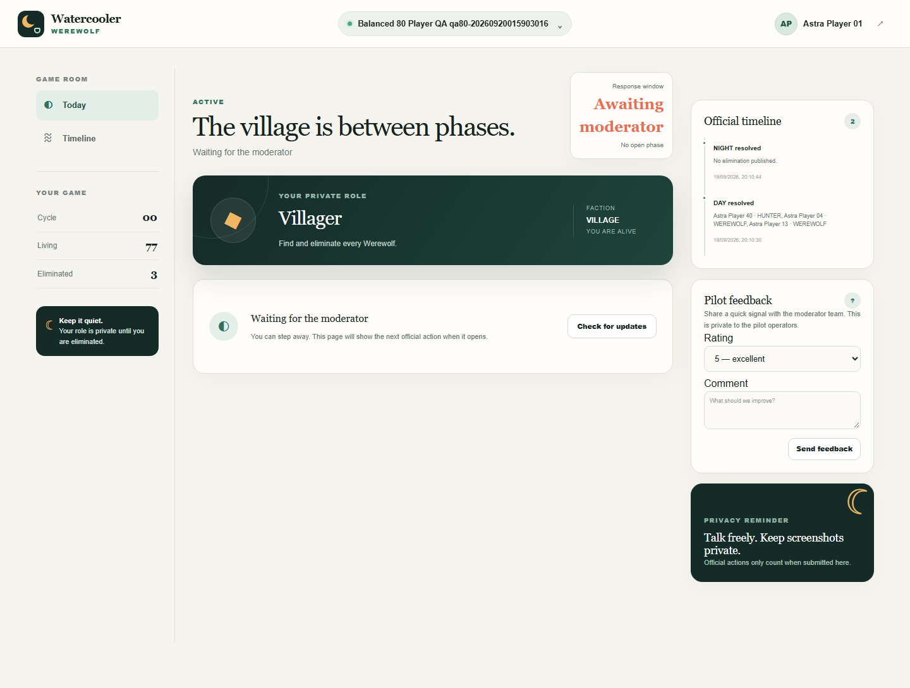
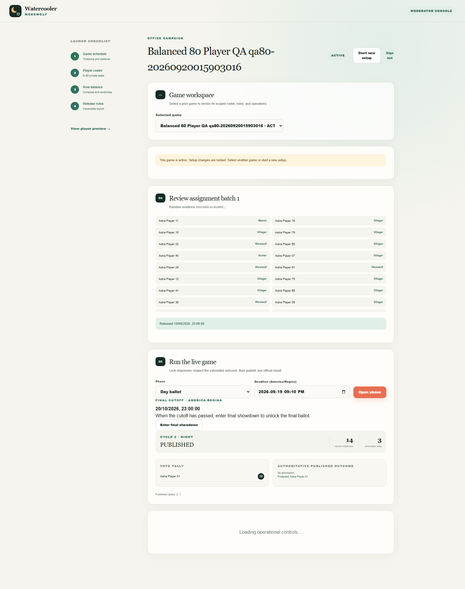

# How to Use Watercooler Werewolf

For first-time players and moderators. Updated September 22, 2026 against current source. Screenshots use fictional players; your names, counts, and dates will differ. Use the game URL your organizer supplies. No installation or ChatGPT account is required.

[Basics](#game-basics) · [Join and play](#join-and-play) · [Every role](#every-role) · [Moderator setup](#moderator-setup) · [Run phases](#run-each-phase) · [Finish](#finish-the-game) · [Help](#help-and-recovery)

## Game basics

Werewolf is a game of discussion and hidden identities. Most players belong to the **Village**; a few are **Werewolves** pretending to be villagers. Discuss suspicions through the organizer's agreed channel, then record your choices in the app. Chat messages and spoken votes do not count as submissions.

- **Day:** every living player, including Werewolves, votes to eliminate other players.
- **Night:** living Werewolves choose attacks; the Seer investigates; the Bodyguard protects; a living Apprentice Seer investigates after the Seer is eliminated; Cupid chooses two lovers once. Other roles wait.
- **Moderator:** runs the schedule and publishes results. They can see all roles and private rooms, so should not also play a seat in that game.
- **Village wins** when no Werewolves remain alive. **Werewolves win** when their living number equals or exceeds all living Village players combined. The app checks after each published result.

A *phase* is one response window: Day, Night, or Final ballot. A *seat* is your private player account. An *elimination slot* is the maximum number of ordinary targets that phase can eliminate. Protection, missing votes, and the Hunter can change the actual total.

## Join and play

### Join once; sign in again later

1. Open the private claim link sent by your moderator. Check your name and game name.
2. Choose a **six-digit PIN**, then select **Claim my seat** → **Enter the game**. Keep the one-time link and PIN private.
3. Wait for the moderator to release roles. Your dashboard will show **Your private role**.
4. On later visits, open the same site's `/player-login` page. Enter the **email address from your invitation** and **Six-digit PIN**, then **Enter the game**. Your seat code also works as a fallback. Do not repeat the one-time claim step.

Forgot your PIN? Ask for a PIN reset. If email sign-in opens the wrong game or cannot find your seat, ask the moderator for your seat code. Never use another player's invitation.

### Submit a vote or action

1. Open **Today**. Read the phase, **Response window**, and action heading below your role.
2. Select player cards. For a single-target action, selecting someone new replaces your previous choice; select the current card again to clear it. For multi-target ballots, select up to the displayed maximum.
3. Select **Save response** and wait for the success message. Selecting cards alone does not submit them.
4. To revise, change the selection and **Save response** again before the deadline or moderator lock. Only your latest saved response counts.
5. After publication, read **Official timeline** for eliminations and revealed roles. Announcements and Seer results also appear in **Private result history**; use **Load older updates** when available.

Most actions cannot target yourself or an eliminated player, and you cannot select the same person twice. Cupid may include themself in the pair. The app shows legal candidates. Missing a window means no action; there is no blank-response button to withdraw an already saved vote. Pages refresh about every ten seconds; **Check for updates** is available on the waiting screen.

Default Day, Night attack, and Final ballot limits depend on the living count when the phase opens:

| Living players | Maximum targets per voter / ordinary elimination slots |
| --- | --- |
| 1–30 | 1 |
| 31–60 | 2 |
| 61–80 | 3 |

You may select fewer than the maximum. The Seer, Bodyguard, and Hunter always choose just one target for their special action. Follow the limit displayed in your game.



*After a Night result: read the timeline on the right. “Between phases” means the moderator has not opened the next window. On a narrow screen, scroll down for the timeline, rooms, and updates.*

## Every role

All nine roles vote during Day and Final ballots while alive. The Mayor's vote counts twice in those ballots. All except the Werewolf belong to the Village.

| Role | What to do beyond the shared voting steps | Private information and example |
| --- | --- | --- |
| **Villager** | Discuss suspicions and vote. No Night action; wait for the next Day. | Your role and published results. [Villager screen](images/how-to-use/role-villager.png). |
| **Werewolf** | At Night, use **Choose the pack targets**, select up to the displayed limit, and **Save response**. Each living wolf submits their own ballot; the app combines the votes. You cannot attack another Werewolf. | **Your pack** lists fellow wolves; **Pack room** is for coordination. [Werewolf screen](images/how-to-use/role-werewolf.png). |
| **Seer** | At Night, use **Choose a player to investigate** and save one other living player. After publication, read their **exact role** in **Private result history**. | Your investigation results are private to you and moderator access. [Seer screen](images/how-to-use/role-seer.png). |
| **Bodyguard** | At Night, use **Choose a player to protect** and save one other living player. Protection blocks a Werewolf attack on that player for this Night. It does not prevent a Day elimination or Hunter shot. The public timeline notes when protection stops a pack attack without naming the protected player. | Your role and saved choice; no Seer-style investigation result. [Bodyguard screen](images/how-to-use/role-bodyguard.png). |
| **Hunter** | No ordinary Night action. If a reviewed result eliminates you, including through a lover bond, **Choose your final target** appears in a separate window. Save one living player not already being eliminated in that result. No response before its deadline means no shot. | Your final-target form appears only when required, before publication of your elimination. [Hunter screen before a phase](images/how-to-use/role-hunter.png). |
| **Mason** | No Night power. Coordinate with fellow Masons and vote during Day. | **Fellow Masons** identifies teammates; **Mason room** provides chat. [Mason screen](images/how-to-use/role-mason.png). |
| **Apprentice Seer** | Wait while the Seer is alive. After the Seer is eliminated, investigate one living player each Night. | Inherits the Seer's earlier investigation results and keeps new results in **Private result history**. |
| **Mayor** | Vote during Day and Final ballots. Your submitted vote counts twice. | Your role card explains the double vote. |
| **Cupid** | On a Night before a pair is chosen, select exactly two living players, including yourself if you wish, and save. | The linked players receive private notice. If either is eliminated, the other is eliminated too, regardless of faction. |

Use **Hide role** on your role card when you are playing somewhere other people can see your screen. Use **Show role** to reveal it again. A new elimination opens a prominent game alert; the same event stays dismissed on that device after you close it. Selecting **View votes** in the timeline opens the public ballot in a centered, scrollable panel.

Use **Private room**, choose a room tab if shown, type a message, and **Send**. Messages allow up to 1,000 characters. Moderators can read and moderate rooms. Keep role screenshots and room contents private; agree on discussion etiquette before play.

After elimination, your role becomes public, normal votes and powers stop, and you can spectate and use **Afterlife**. Former Pack/Mason rooms become read-only. Do not pass eliminated-player information back to living players. At completion or Stop, all rooms become read-only.

## Moderator setup

### Before inviting anyone

Have your moderator email/password, 6–80 players with unique email addresses, an agreed discussion channel, and a schedule. Moderator accounts are separate from player seats and do not count toward the roster.

Open the organizer's game URL followed by `/moderator`, then **Sign in**. If you see **Owner setup required**, ask the site operator to complete the [one-time setup](../VERCEL_SETUP_GUIDE.md); public registration cannot create the first moderator.

### 1. Create the game

Choose **Start new setup** if needed. In **Schedule the campaign**, enter a name, timezone (for example, `America/Regina`), start/end dates, and **Final cutoff**, then **Create game**. Final cutoff is when you may switch to the closing sequence; it does not end the game automatically.

The displayed default cadence is weekdays, Day closing at 4 PM and Night at 9 AM. **You must still open every phase and enter its deadline.** Use the timezone printed beside the deadline field; player time displays follow their browser locale. Tell players the agreed times and timezone.

Use **Selected game** to return to a game. **Start new setup** leaves it intact; **Back to selected game** returns from the new-game form. Owner-only **Cancel setup and start new game** permanently cancels an unfinished setup and invalidates its invitations and player sessions after confirmation.

### 2. Create seats and deliver invitations

Replace the sample **Roster CSV** text with your roster, using the exact header `display_name,email` and one player per row:

```csv
display_name,email
Alex Example,alex@example.test
Blair Example,blair@example.test
```

This illustrates the format only; supply 6–80 complete rows. Use real addresses only for your real game. For a rehearsal, use the [20-player fictional roster](../fixtures/roster-20.csv).

Select **Create private seats** → **Download invite CSV** immediately. Privately send each person only their own `message_body`; it includes their private claim link. The app does not send invitations. Keep the full CSV private for the fallback seat codes.

Wait until the claim meter shows everyone claimed. Re-importing replaces the unlaunched roster and invalidates old access; use it only to deliberately restart registration, then download and deliver new invitations.

### 3. Balance, randomize, and release

In **Balance the roles**, use the suggested counts or edit them. Counts must total the roster, include at least one Werewolf, have no more than one Seer, Bodyguard, Hunter, Apprentice Seer, Mayor, or Cupid, and have either zero or at least two Masons. The balance score is guidance, not a guarantee of fairness.

The 20-player default is **12 Villagers, 3 Werewolves, 1 Seer, 1 Bodyguard, 1 Hunter, and 2 Masons**. Smaller presets add powers gradually: 6–8 players start with one wolf and Villagers; 9–11 add a Seer; 12–14 use two wolves and a Seer; 15–19 use three wolves, a Seer, and a Bodyguard.

Select **Save composition** after edits. Once all seats are claimed, **Randomize roles**, then privately inspect **Review assignment batch**. If counts change, save and randomize again. Select **Release roles to players** only when ready: players now see their roles, and setup locks. Changing released roles requires starting over through recovery.

Before the first Day, tell players where to discuss, how to save a response, when it closes, and whom to contact for help. Keep the moderator role map off shared screens.

## Run each phase

Repeat **Open → collect → lock and calculate → review → publish**. Start with **Day ballot**, then alternate **Night actions → Day ballot** until victory or Final showdown.

1. Check **Selected game**, then scroll to **Run the live game**. The Phase selector offers the next legal kind. Enter a future **Deadline** in the named timezone and **Open phase**.
2. Let players submit. Watch **current responses**; at Night, not every living role has an action. Remind players through your agreed channel or an in-app notice.
3. At the deadline, select **Lock responses & calculate**. If already locked, select **Calculate locked responses**. Locking closes revisions; do not lock early unless intended. **Check deadlines** in Communications & operations reconciles expired phases but does not publish results.
4. Review **Vote tally**, **Proposed outcome**, protected players, and any recorded random tie. Highest vote counts fill available slots; a tie across the last slot uses a recorded random draw. No votes means no ordinary elimination. Fewer voted targets or protection can leave slots unused.
5. If **Hunter follow-up required** appears, privately prompt the Hunter to open their dashboard. The default window is 60 minutes; follow the displayed deadline. Once they submit, **Finalize Hunter**. With no submission, wait until expiry, then **Finalize Hunter** without a shot. Review the updated result.
6. Select **Approve & publish**. Confirm **PUBLISHED** and inspect **Authoritative published outcome**. Only publication applies eliminations, reveals eliminated roles, delivers Seer results, updates rooms, and checks victory.
7. If no winner appears, open the next legal phase with a new future deadline. Publication does not open it for you.

**Exceptional correction:** expand **Override calculated eliminations**, select the complete intended elimination list (not just additions), and enter an **Audit reason** of at least ten characters. Select **Publish override**. The original calculation and reason remain recorded. If this triggers the Hunter, complete the follow-up and approve the reviewed result before treating it as published. A published phase has no ordinary undo control.



*Scroll below the assignments to Run the live game. This result is already published: a protected target survived. The next Day is offered above it. The screenshot caught the separate Operations panel loading; wait for that panel before using its controls.*

## Finish the game

The app completes a game after a published Village or Werewolf win. Final showdown is unnecessary if a team wins earlier.

If no team has won and **Final cutoff** has passed, finish and publish the current ordinary phase. With no unresolved phase, **Enter final showdown**, then open **Final ballot** with a future deadline. Everyone still alive votes as during Day. Use the same review/Hunter/publication steps. Repeat Final ballots until a team wins; a no-vote ballot does not end the game, and there are no further Nights in showdown.

Confirm **COMPLETED** and the winner in **Official timeline**, publish a closing notice if useful, **Download JSON backup**, and collect **Pilot feedback**. Start a new setup for another game.

**Known Preview display issue:** a completed dashboard may still say “Waiting for the moderator” or “Awaiting moderator,” and Cycle may show 00 between phases or at completion. **COMPLETED** and the timeline winner are authoritative; do not try to run another round. [Completed-game example](images/how-to-use/completed-player.png).

## Help and recovery

Moderator tools are under **Communications & operations**. Check the selected game first.

| Need | Steps and result |
| --- | --- |
| Notify players | Under **Official announcement**, enter **Title** and **Message**, then **Publish notice**. It appears in the app; no email is sent. |
| Add a helper | Owner: in **Co-moderator access**, enter their email and a password of at least 12 characters, then **Add co-moderator**. For a new account, privately deliver access and save the one-time recovery codes. An existing moderator keeps their current credentials. Co-moderators run the game; adding helpers, Reset, restore, and setup cancellation are owner-only. |
| Forgotten player PIN | In **Player access recovery**, choose the claimed player, enter a new six-digit PIN and a reason of at least five characters, then **Reset player PIN**. Deliver it privately. Old sessions are signed out. |
| Forgotten moderator password | On sign-in, **Forgot password? Use a recovery code** → enter email, unused code, and a new password of at least 12 characters → **Recover access**. Old sessions are invalidated. With no code, contact the operator; there is no email reset. |
| Moderate chat | Under **Private rooms**, use **Make read-only** or **Reopen**. **Remove** on a visible message requires a reason. **Purge expired** removes messages older than the displayed retention period (default seven days). |
| Save a record | **Download JSON backup**. Keep it private: it includes assignments and private rooms. Check the last-export time updates. |
| Stop play | **Stop game** → reason of at least five characters → confirm. Actions stop and rooms become read-only. This is not a temporary pause; there is no Resume control. |
| Restart this game | Owner: **Reset to setup** → exact game name → confirm. A backup is created; roles, gameplay, player sessions, and old invitations are cleared. Re-import the roster, deliver fresh invitations, reclaim seats, and randomize/release again. |
| Recover a roster/configuration | Owner: **Recovery restore** → stored **Snapshot** → **Restore to setup** → exact name → confirm. A safety backup is created. Immediately **Download fresh invites**. Players reclaim seats; randomize/release again. It restores setup, not an in-progress game; there is no JSON-upload control. |

See [Operations and recovery](OPERATIONS.md) for full recovery consequences. Players can send a private rating/comment using **Pilot feedback** → **Send feedback**; moderators use **Save feedback**.

| What you see | What to do |
| --- | --- |
| Wrong game, invalid link, failed sign-in | Use the exact site from the invitation; Preview and Production are separate. For an already claimed seat, use player sign-in. Ask if invitations were replaced. |
| “Not released” role | Wait for the moderator to release roles. |
| Randomize disabled | Check all seats are claimed and edited counts are saved. |
| Save unavailable | Select a legal player. Check for an expired/locked phase, no action for your role, or elimination. |
| Waiting for moderator | Check status and timeline. During play, opening/publication may be pending; at completion trust the timeline winner. |
| Hunter cannot be finalized | Wait for their submission or displayed deadline, then retry. |
| Final showdown rejected | Check cutoff has passed and the latest ordinary phase is published. |
| Too many attempts | Stop retrying and allow the limit to expire. If no wait time is shown, ask the moderator; sign-in limits use 15-minute windows. |
| Error after a moderator action | Refresh and inspect state first; another moderator may have completed it. Share error text privately without credentials or other players' roles. |

**Moderator reminder:** check game → open → let players save → lock/calculate → resolve Hunter → review/publish → check winner → next phase or close out.

Screenshot provenance and verification limits: [documentation audit](DOCUMENTATION_REVIEW_2026-09-20.md).
