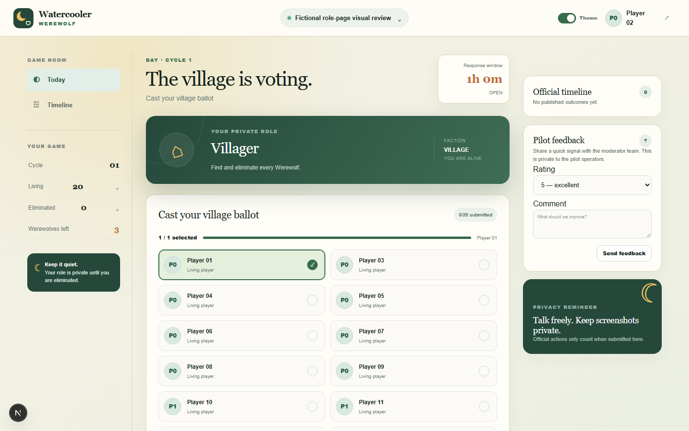
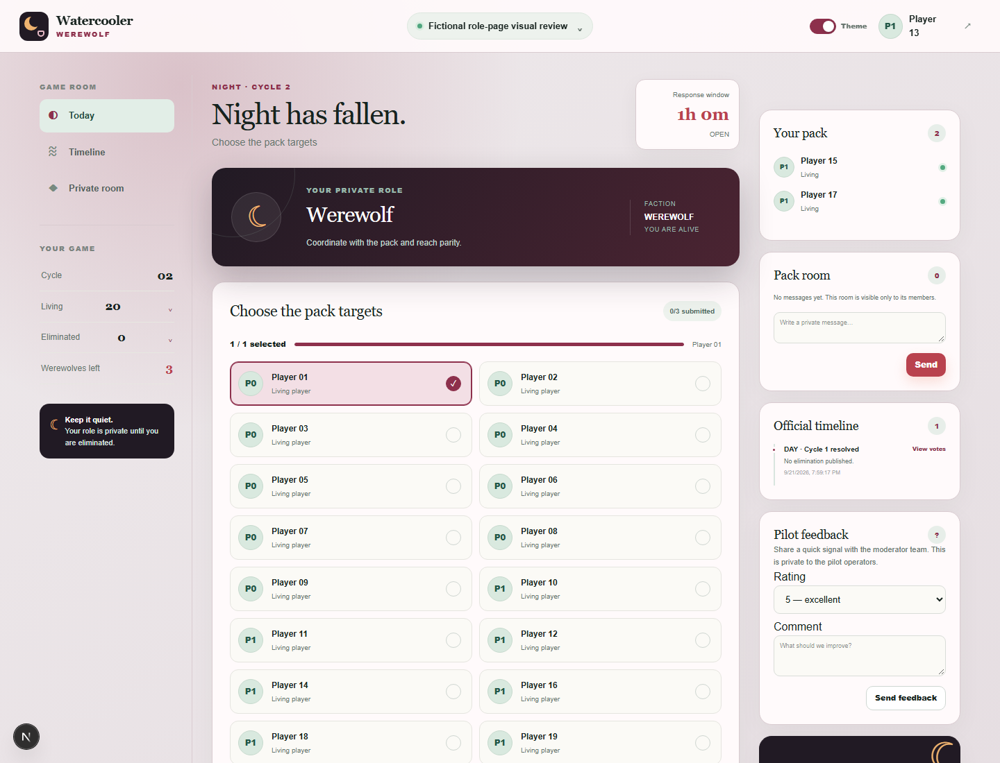
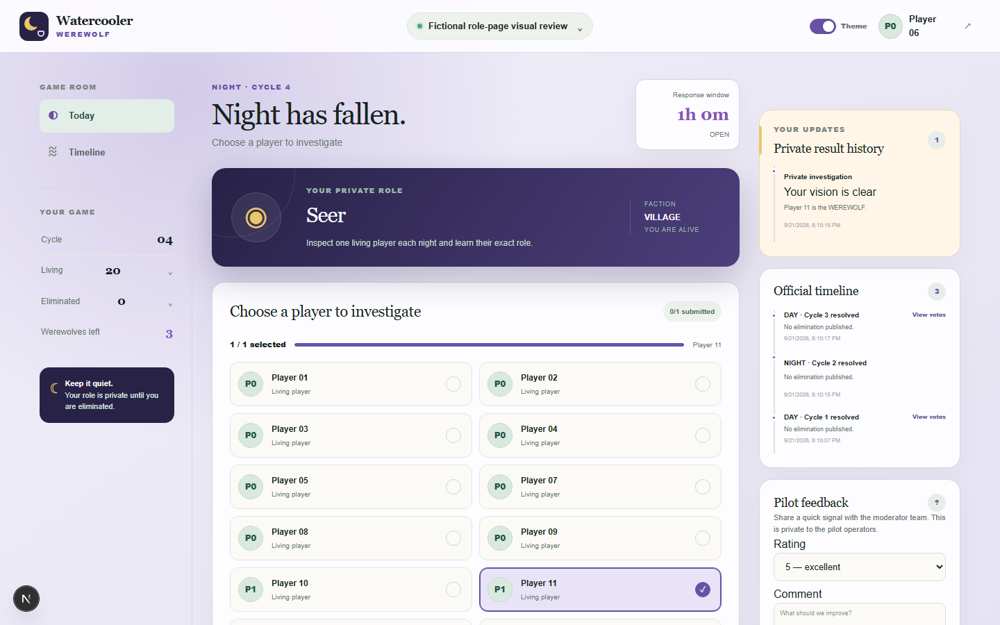
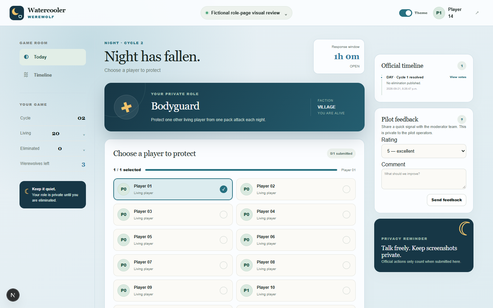
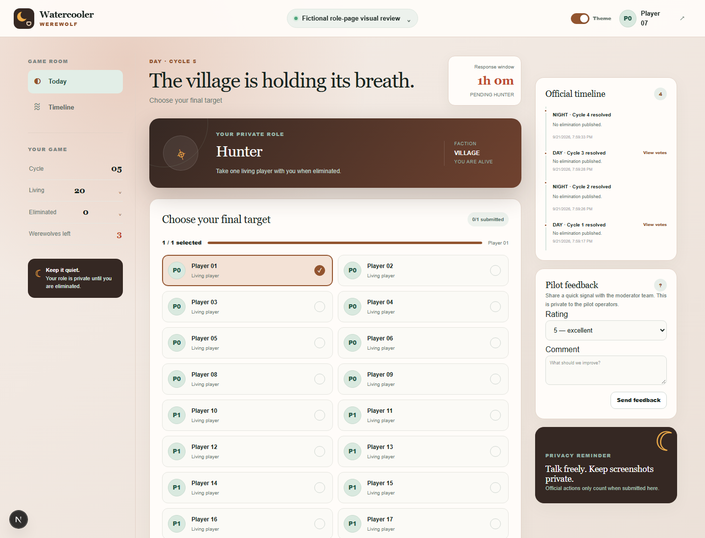
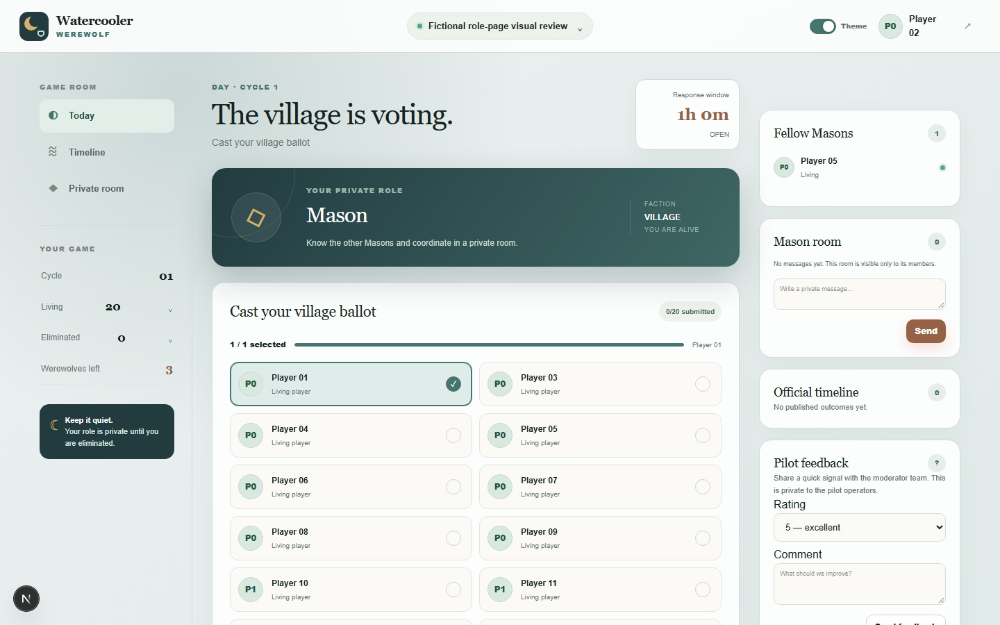

# Role-page visual review

These screenshots use fictional players in a 20-seat test game so every supported role is present. The optional role theme is turned on in each image; it is off by default when a player opens or reloads the page.

## Villager

The Villager sees the daytime ballot and can select one living player.

## Werewolf

The Werewolf sees the nighttime target picker, fellow Werewolves, and the private pack room.

## Seer

The Seer selects one living player at night. Previous private investigations remain visible in **Private result history**, including the exact role learned, so the Seer can keep track without relying on memory.

## Bodyguard

The Bodyguard selects one living player to protect during the night.

## Hunter

If the Hunter is selected for elimination, the moderator first calculates and reviews the result. Before that result is published, the Hunter receives this required final-target picker. This avoids revealing an unpublished death to the rest of the game while still letting the Hunter take the final shot.

## Mason

The Mason sees fellow Masons and the private Mason room alongside the normal daytime ballot.

